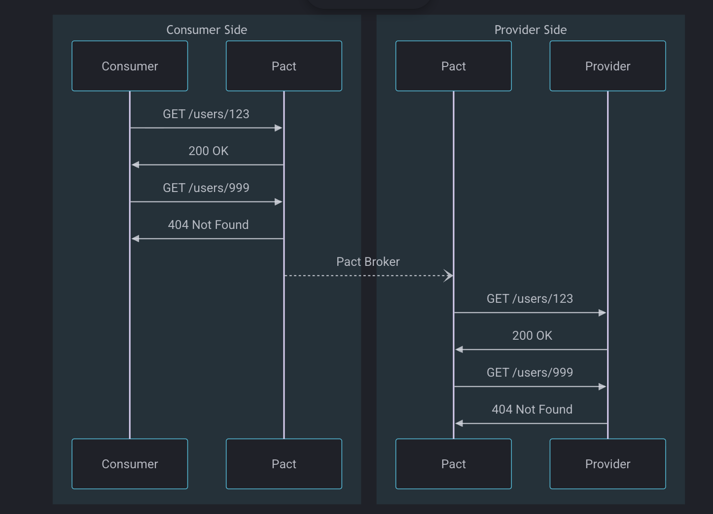

# Microservices Contract Testing with Pact



This project demonstrates **consumer-driven contract testing** between two microservices:

- **Consumer:** `ms-tasks`
- **Provider:** `ms-tags`

```lua
 +----------------+        Pact Contract       +----------------+
 |   ms-tasks     |  --------------------->   |  Pact Broker   |
 | (Consumer)     |   generates & publishes   |  (Shared)      |
 +----------------+                           +----------------+
           |                                         ^
           |                                         |
           | Request/Response                        |
           | (during verification)                   |
           v                                         |
 +----------------+      fetches & verifies        |
 |   ms-tags      |  -------------------------------+
 | (Provider)     |   ensures it meets contract
 +----------------+

```

It uses **Pact** for contract generation and verification, with a **self-hosted Pact Broker** for sharing contracts.

---

## Prerequisites

- Python 3.12+
- `pip`
- Docker & Docker Compose **or** Node.js + npm

---

## 1. Install Python dependencies

```bash
pip install uv
uv sync -n
```

---

## Run Pact Broker

You can run a local Pact Broker in **two ways**:

```bash
docker compose -f pact-broker.yml up -d
```

- Pact Broker will be available at [http://localhost:9292](http://localhost:9292)
- Contracts generated by consumer tests will be persisted in `ms-tasks/tests/pacts/`

To stop the broker:

```bash
docker compose -f pact-broker.yml down
```

---

### Install Pact CLI

We will use `pact-broker` to publish pacts into the broker

1. Install the Pact CLI globally:

```bash
npm install -g @pact-foundation/pact-cli
```

---

## 3. Run Consumer Tests

Generate contracts from the consumer (`ms-tasks`) tests:

```bash
pytest ms-tasks/tests/test_consumer_contract.py
```

- Contracts are written to:

```
ms-tasks/tests/pacts/
```

- Contracts use **matchers** (e.g., `tag_id` is a UUID) instead of hardcoded values

---

## 4. Publish Contracts to Pact Broker

Publish the generated contracts to the broker:

```bash
pact-broker publish ms-tasks/tests/pacts \
  --consumer-app-version=1.0.0 \
  --broker-base-url=http://localhost:9292
```

- Replace `1.0.0` with your current consumer version
- The broker now stores your contracts for any provider verification

---

## 5. Verify Provider

Run provider (`ms-tags`) tests to verify it satisfies the contract:

```bash
pytest ms-tags/tests/test_provider_contract.py
```

- Provider test fetches the contract from the broker and verifies against your service
- The test fails if the provider violates the contract (wrong body shape, headers, or type)

---

## Notes

- **Contracts use matchers:** e.g., `tag_id` is expected to be a valid UUID, not a fixed value
- **Provider state:** The provider can define endpoints to set up states like `tag exists` for realistic tests
- **Headers:** Pact verification may require headers to match expected structure; use matchers if needed
- **CI/CD:** You can integrate contract generation, publishing, and provider verification in pipelines

---

## Optional: Inspect Pact Broker

Once the broker is running:

- Open [http://localhost:9292](http://localhost:9292) in a browser
- You can view all published consumer contracts and versions

---

### Used resources

- [https://www.npmjs.com/package/@pact-foundation/pact-cli?activeTab=readme](https://www.npmjs.com/package/@pact-foundation/pact-cli?activeTab=readme)
- [https://github.com/pact-foundation/pact-python](https://github.com/pact-foundation/pact-python)
